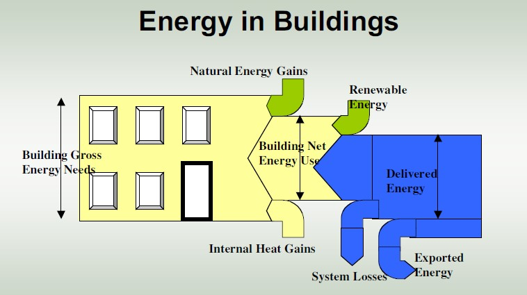

# Builing-Energy-Load-Prediction
Machine Learning Model for prediction of Heat Load and Cooling Load for Energy Efficient Buildings.

The effect of eight input variables (relative compactness, surface area, wall area, roof area, overall height, orientation, glazing area, glazing area distribution) on two output variables, namely heating load (HL) and cooling load (CL), of residential buildings is investigated using a statistical machine learning framework. We have to use a number of classical and non-parametric statistical analytic tools to carefully analyse the strength of each input variable's correlation with each of the output variables in order to discover the most strongly associated input variables. 

https://user-images.githubusercontent.com/94790472/159898487-943b142e-d0d1-48a5-9bcf-0f9241d31f42.mp4
